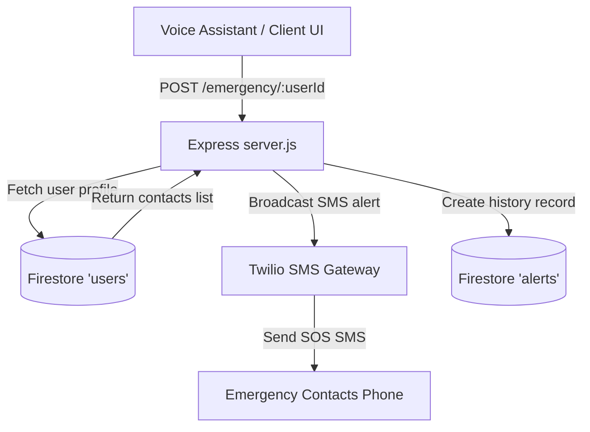
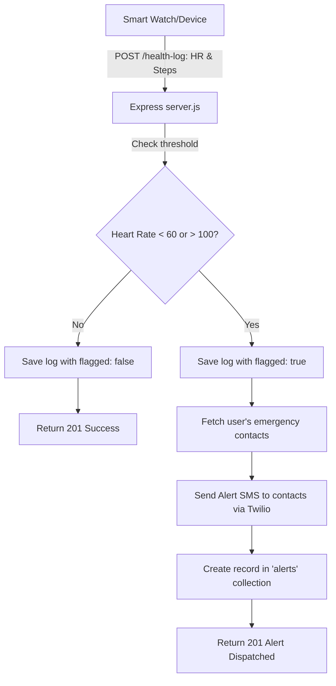

# AI Digital Personal Assistant for Elderly - Backend

Welcome to the backend server for the **AI Digital Personal Assistant for Elderly**! This server is built using **Node.js** and **Express**, with **Firebase Firestore** as the database, **Twilio** for emergency SMS alerts, and **node-cron** for background tasks (medicine schedules and daily refreshes).

This API is designed to be consumed by a separate **voice assistant module** and a **frontend user interface (website/app)**.

---

## 📂 Project Folder Structure

This project follows a clean **MVC (Model-View-Controller)** inspired backend architecture to keep concerns separate and the codebase maintainable:

```
backend/
├── src/
│   ├── config/          # Service configurations (Firebase DB & Twilio SMS)
│   │   ├── firebase.js  # Firebase Admin SDK initialization & DB connection helper
│   │   └── twilio.js    # Twilio SMS initialization with Simulation fallback mode
│   ├── controllers/     # Business logic per feature (contains logic for requests/responses)
│   │   ├── userController.js         # User registration & profile retrieval
│   │   ├── medicineController.js     # Adding schedules, getting schedules & updates
│   │   ├── appointmentController.js  # Doctor appointment bookings & listings
│   │   └── healthController.js       # Health logging, anomaly checks & SOS panic trigger
│   ├── routes/          # Express route definitions mapping URLs to controllers
│   │   └── api.js       # Root routing configuration for exact endpoints
│   ├── jobs/            # Scheduled background worker tasks
│   │   └── reminderJob.js  # Minutely due/overdue checker & Daily midnight state reset
│   └── server.js        # The app entry point (middleware binding, database startup, server run)
├── .env.example         # Template environment variables (no real credentials/secrets)
├── .gitignore           # List of directories/files to ignore in version control (e.g., node_modules, .env)
├── package.json         # Project metadata, dev scripts, and package dependencies
└── README.md            # You are here! Complete documentation and project setup guide
```

---

## 🛠️ Step-by-Step Installation & Setup

Follow these steps to run the server on your local machine:

### 1. Prerequisites
Make sure you have [Node.js](https://nodejs.org/) installed (v14 or higher recommended).

### 2. Clone and Install Dependencies
Navigate to the `backend` directory and install the necessary npm packages:
```bash
# Go to backend directory
cd backend

# Install dependencies
npm install
```

### 3. Setup Environment Variables (`.env`)
Create a file named `.env` in the root of the `backend` directory. Use the template in `.env.example` as a reference:
```bash
# Copy example env to a local dotenv file
cp .env.example .env
```
Fill in the values inside `.env` as explained below.

#### How to acquire credentials:
* **`PORT`**: Set it to your desired port number (e.g., `5000`).
* **Firebase Credentials (`FIREBASE_*`)**:
  1. Open the [Firebase Console](https://console.firebase.google.com/).
  2. Create a new project (e.g. "Elderly Personal Assistant").
  3. Go to **Project Settings** (gear icon) > **Service Accounts**.
  4. Select **Node.js** and click **Generate new private key**. This downloads a JSON file.
  5. Open the JSON file and extract the variables:
     * `project_id` ➔ Copy into `FIREBASE_PROJECT_ID`
     * `client_email` ➔ Copy into `FIREBASE_CLIENT_EMAIL`
     * `private_key` ➔ Copy into `FIREBASE_PRIVATE_KEY` (make sure to replace real newlines with `\n` in a single line inside quotes).
* **Twilio Credentials (`TWILIO_*`)**:
  1. Sign up for a free developer account at [Twilio](https://www.twilio.com/).
  2. Go to the Twilio Console Dashboard.
  3. Copy your **Account SID** and **Auth Token** into `TWILIO_ACCOUNT_SID` and `TWILIO_AUTH_TOKEN`.
  4. Buy a **Twilio Phone Number** (it is free for trial accounts) and copy it into `TWILIO_PHONE_NUMBER`.
* **`MEDICINE_GRACE_PERIOD_MIN`**: The number of minutes before a pending medicine is marked as "missed" (default is `30`).

> [!NOTE]
> **Developer-Friendly Twilio Simulation Fallback**:
> If you do not have Twilio credentials or they are left as placeholders, the server will load in **Simulation Mode**. Instead of crashing or failing, it will print simulated SMS notifications directly into your server command terminal.

---

## 🚀 Running the Server

To start the server, you have two commands available in your package scripts:

* **Development Mode** (auto-restarts when files change using `nodemon`):
  ```bash
  npm run dev
  ```
* **Production Mode** (standard execution):
  ```bash
  npm start
  ```

---

## 📊 Database Collections (Firestore Schema)

The server stores and updates five distinct collections in Firebase Firestore:

| Collection | Schema / Fields | Description |
| :--- | :--- | :--- |
| **`users`** | `userId`, `name`, `age`, `phone`, `emergencyContacts[]` | Stores user profiles. `emergencyContacts` contains objects with `{ name, relation, phone }`. |
| **`medicines`** | `medId`, `userId`, `medicineName`, `dosage`, `time`, `frequency`, `status` | Stores medicine schedules. `status` can be `"pending"`, `"taken"`, or `"missed"`. |
| **`appointments`** | `apptId`, `userId`, `doctorName`, `date`, `time`, `location`, `reminderSent` | Stores upcoming doctor consultations. |
| **`healthLogs`** | `logId`, `userId`, `heartRate`, `steps`, `timestamp`, `flagged` | Health tracks. `flagged` becomes `true` if heartRate falls outside 60-100 bpm. |
| **`alerts`** | `alertId`, `userId`, `type`, `timestamp`, `notifiedContacts[]` | Stores history of all SOS triggers, medicine misses, or health alarms. |

---

## 📡 API Reference & Endpoints

All endpoints are mapped directly on the server's root URL:

| Method | Path | Request Body / Parameters | Description |
| :--- | :--- | :--- | :--- |
| **POST** | `/register` | **Body (JSON)**:<br>`{ "userId": "optional_id", "name": "John Doe", "age": 78, "phone": "+1234567890", "emergencyContacts": [{ "name": "Mary Doe", "relation": "Daughter", "phone": "+1098765432" }] }` | Registers a new user. If no `userId` is supplied, Firestore auto-generates a unique one. |
| **GET** | `/user/:userId` | **Params**: `userId` | Fetches the elderly user's profile and contact list. |
| **POST** | `/medicine` | **Body (JSON)**:<br>`{ "userId": "id", "medicineName": "Aspirin", "dosage": "1 tablet", "time": "08:30", "frequency": "Daily" }` | Schedules a new medicine. Time format must be **HH:MM** (24h). Initial status starts as `"pending"`. |
| **GET** | `/medicine/:userId` | **Params**: `userId` | Retrieves all medicine schedules for the specified user. |
| **PUT** | `/medicine/:medId/status` | **Params**: `medId`<br>**Body (JSON)**: `{ "status": "taken" }` | Updates medicine status. Options are: `"pending"`, `"taken"`, or `"missed"`. |
| **POST** | `/appointment` | **Body (JSON)**:<br>`{ "userId": "id", "doctorName": "Dr. Smith", "date": "2026-07-25", "time": "11:30", "location": "General Hospital" }` | Books a new appointment. Date must be **YYYY-MM-DD** and time **HH:MM**. |
| **GET** | `/appointment/:userId` | **Params**: `userId` | Lists all upcoming doctor appointments for the user, sorted chronologically. |
| **POST** | `/health-log` | **Body (JSON)**:<br>`{ "userId": "id", "heartRate": 105, "steps": 2500 }` | Logs health data. Automatically marks as `flagged` if heartRate < 60 or > 100 bpm. If flagged, sends Twilio SMS to all contacts. |
| **POST** | `/emergency/:userId` | **Params**: `userId` | **Panic SOS trigger**. Instantly fetches the user's emergency contacts, broadcasts an SOS warning SMS, and logs the incident in alerts. |

---

## 🔔 Notification & Automation Flows (Perfect for Viva Explanation!)

If requested to present your code flow during your viva exam, here is an explanation of the primary backend components:

### 1. Emergency Panic SOS Flow


### 2. Health Log Monitoring Flow


### 3. Background Medicine Cron Worker Flow
The background job (`node-cron`) acts as an automated scheduler running every single minute:
* **Due Alerts**: It parses the current time. If it matches a pending medicine's schedule time exactly, it logs `[Reminder Due] Medicine is scheduled now` to the system terminal.
* **Overdue Warnings**: If a medicine's status remains `"pending"` and the current time is past the scheduled time by more than `MEDICINE_GRACE_PERIOD_MIN` (e.g. 30 minutes), the background job:
  1. Automatically marks the status as `"missed"` in Firestore (preventing repeat notifications).
  2. Dispatches warning SMS alerts to the user's emergency contacts: *"Medicines missed!"*
  3. Records a `"MEDICINE_MISSED"` alert document in the database.
* **Daily Status Reset**: Everyday at midnight (`00:00`), a second cron job automatically resets all active medicine statuses back to `"pending"` so they are ready for the new day's tracking sequence.
